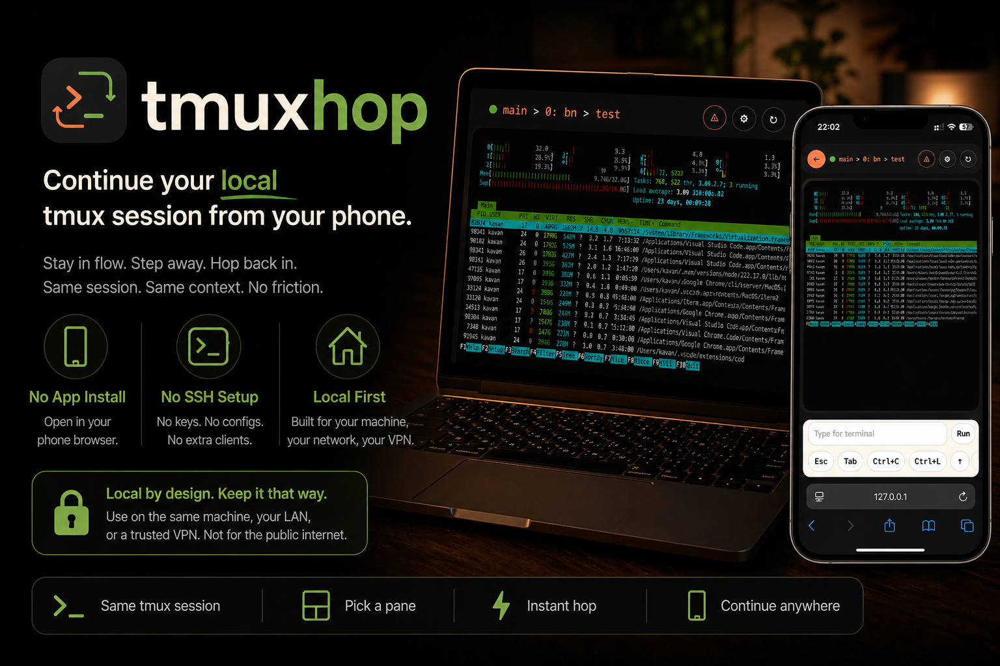

<p align="center">
  
</p>
<p align="center">Sigue programando cuando la vida te obliga a levantarte.</p>

<p align="center">
  
  
  
  
</p>

<p align="center">
  <a href="README.md">English</a> |
  <a href="README.zh-TW.md">繁體中文</a> |
  <a href="README.ja.md">日本語</a> |
  <a href="README.ko.md">한국어</a> |
  Español |
  <a href="README.fr.md">Français</a>
</p>



## Por qué usarlo

```text
💻 estás en pleno vibe coding
-> 💩 tienes que ir al baño
-> 📱 abres tmuxhop en el teléfono
-> 🤖 sigues diciéndole a la IA qué hacer
-> ✅ mantienes el flow
```

## Inicio rápido

```sh
git clone https://github.com/<your-org-or-user>/tmuxhop.git
cd tmuxhop
npm install
tmux has-session 2>/dev/null || tmux new -d -s tmuxhop
npm start
```

Abre la app:

```text
http://127.0.0.1:3000/
```

Para acceder desde el teléfono en la misma red local:

```sh
HOST=0.0.0.0 PORT=3000 npm start
```

Luego abre `http://<your-computer-ip>:3000/` en el navegador del teléfono.

## Cómo funciona

tmuxhop lee el estado de tu sesión local de `tmux`, lo expone mediante un pequeño servidor Node y renderiza el pane seleccionado en el navegador con `xterm.js`. La interfaz del navegador está pensada para tocar, pero la sesión subyacente sigue siendo la misma.

La idea no es ofrecer un escritorio remoto completo. La idea es poder saltar a otro dispositivo por unos minutos y seguir trabajando.

## Requisitos

- Node.js 22+
- `tmux` instalado localmente
- un navegador en la misma máquina, LAN o VPN

Por defecto, tmuxhop busca:

- `tmux` en `/opt/homebrew/bin/tmux`
- una sesión por defecto llamada `tmuxhop`

Puedes cambiarlo con estas variables de entorno:

- `TMUX_BIN`: ruta al binario de `tmux` que debe usar tmuxhop
- `TMUXHOP_SESSION`: nombre de la sesión por defecto que tmuxhop debe buscar o sugerir
- `TMUXHOP_SCROLLBACK_LINES`: cuántas líneas de scrollback mantener en el terminal del navegador
- `HOST`: la interfaz de red a la que se enlaza el backend
- `PORT`: el puerto en el que sirve el backend

## Modelo de seguridad

tmuxhop es deliberadamente ligero. No te pide configurar SSH en el teléfono ni exponer un servicio remoto de shell general a internet.

Úsalo en:

- la misma máquina
- una red local de confianza
- o una VPN

No lo trates como un servicio endurecido para internet público en su estado actual.

## Límites

- Flujo de trabajo para un solo usuario
- Basado en `tmux`, no en multiplexores arbitrarios
- Terminal de navegador, no sustituto de escritorio
- Herramienta para continuar el flow en móvil, no una plataforma completa de acceso remoto

## Desarrollo

Ejecuta los tests:

```sh
npm test
```

Solo comprobación de tipos:

```sh
npm run typecheck
```

Compila el cliente:

```sh
npm run build
```

## Licencia

MIT
