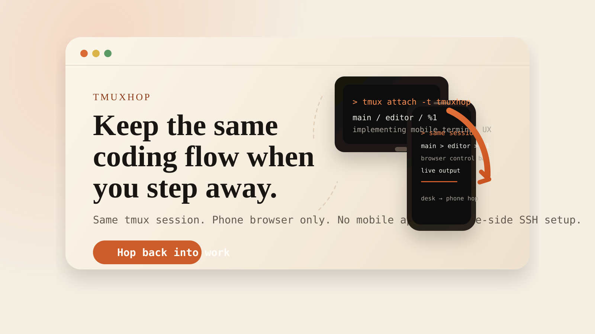

# tmuxhop

tmuxhop lets you continue the same local `tmux` session from your phone in a browser. It is built for short desk-to-phone hops when you want to keep coding momentum without installing a mobile app, setting up SSH on the phone, or starting a fresh shell.



## Why Use It

- Keep the same coding session alive when you step away from your desk.
- Open it from a phone browser with no mobile app install.
- Avoid phone-side SSH setup, key management, and extra client configuration.
- Stay focused on continuity, not remote access administration.

## How It Works

tmuxhop reads your local `tmux` session state, exposes it through a small Node server, and renders the selected pane in the browser with `xterm.js`. The browser UI is touch-friendly, but the underlying session stays the same.

The goal is not full remote desktop access. The goal is to make it easy to hop to another device for a few minutes and keep going.

## Requirements

- Node.js 22+
- `tmux` installed locally
- a browser on the same machine, LAN, or VPN

By default, tmuxhop looks for:

- `tmux` at `/opt/homebrew/bin/tmux`
- a default session named `tmuxhop`

You can override those with:

- `TMUX_BIN`
- `TMUXHOP_SESSION`
- `TMUXHOP_SCROLLBACK_LINES`
- `HOST`
- `PORT`

## Installation

```sh
npm install
```

## Usage

Start or reuse a tmux session:

```sh
tmux new -As tmuxhop
```

Start tmuxhop:

```sh
npm start
```

Open the app:

```text
http://127.0.0.1:3000/
```

For phone access on the same local network:

```sh
HOST=0.0.0.0 PORT=3000 npm start
```

Then open `http://<your-computer-ip>:3000/` from the phone browser.

## Security Model

tmuxhop is intentionally lightweight. It does not ask you to set up mobile SSH or expose a general remote shell service to the internet.

Use it on:

- the same machine
- a trusted local network
- or a VPN

Do not treat it as a hardened public internet service in its current form.

## Limits

- Single-user workflow.
- Built around `tmux`, not arbitrary terminal multiplexers.
- Browser terminal, not desktop replacement.
- Mobile-first continuity tool, not a full remote access platform.

## Development

Run the test suite:

```sh
npm test
```

Run type-checking only:

```sh
npm run typecheck
```

Build the client:

```sh
npm run build
```

## License

ISC
